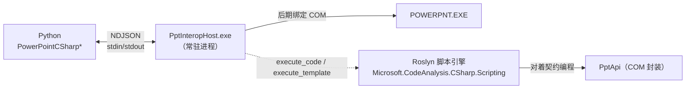
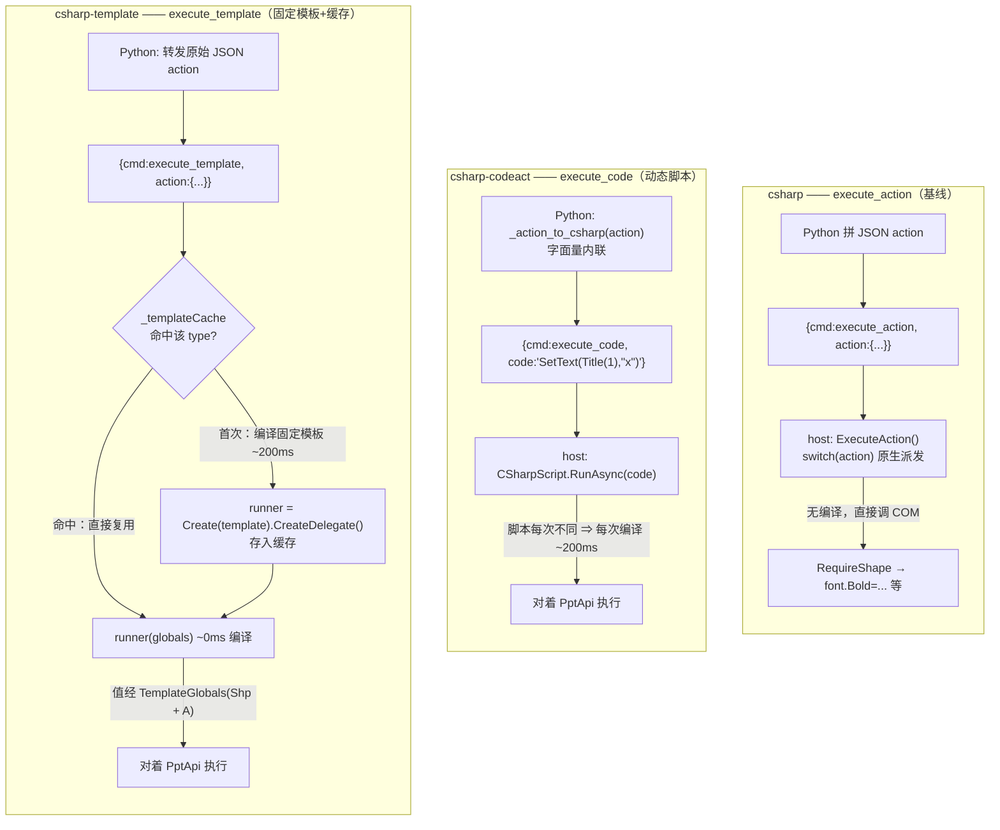
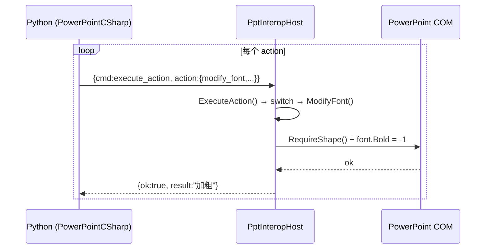
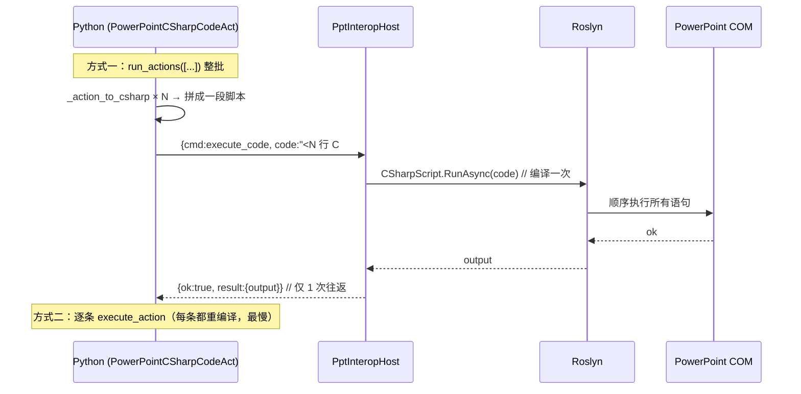
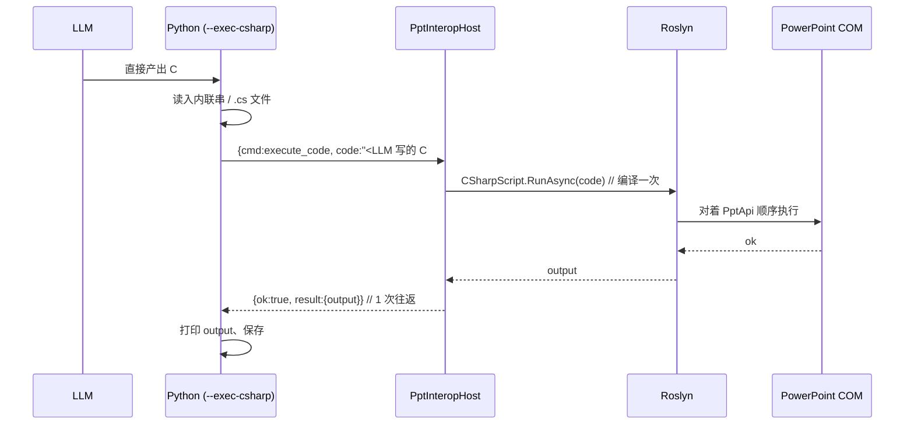

# C# 三种 backend 原理对比：`csharp` / `csharp-codeact` / `csharp-template`

本文对比 PPT Editor 中三种基于 **C# Interop host** 的执行策略。三者**共享同一套底层基础设施**，区别只在「脚本怎么来、怎么编译、怎么往返」这一层。

> **脚本从哪来有两种来源**：
> - **机器生成**：上游产出 JSON，由 Python（codeact 的 `_action_to_csharp`）或 host（template 的固定模板）把 JSON 翻译成 C#。
> - **LLM 直出**：LLM 直接写 C# 脚本，经 CLI 入口 `--exec-csharp` 走 `code_act`（`execute_code`）一次执行 —— 见 [§4.4](#44---exec-csharpllm-直接产出-c-脚本)。

> 相关源码：
> - host：[`csharp_interop/PptInteropHost/Program.cs`](../csharp_interop/PptInteropHost/Program.cs)、[`PptApi.cs`](../csharp_interop/PptInteropHost/PptApi.cs)
> - Python backend：[`ppt_backend.py`](../ppt_backend.py)（`PowerPointCSharp` / `PowerPointCSharpCodeAct` / `PowerPointCSharpTemplate`）

---

## 1. 共享基础（三者完全相同）

| 组件 | 说明 |
|------|------|
| **常驻进程** | `PptInteropHost.exe`（.NET 9.0-windows 控制台程序），一次启动、长期复用 |
| **通信协议** | NDJSON over stdin/stdout：请求 `{"cmd":...}` → 响应 `{"ok":true,"result":...}` / `{"ok":false,"error":...}` |
| **COM 访问** | 后期绑定（`dynamic` / IDispatch），与 pywin32 同机制 —— 对比的是 IPC 成本而非语言 |
| **约定** | 颜色 **BGR**（红=0x0000FF）、位置/大小 **points**（72pt=1in）、索引 **1-based** |
| **退化路径** | 三者无法处理的动作，最终都回退到 JSON `execute_action`（基础 C# backend 的行为是超集） |



---

## 2. 三者一览

| 维度 | `csharp` | `csharp-codeact` | `csharp-template` |
|------|----------|------------------|-------------------|
| host 命令 | `execute_action` | `execute_code` | `execute_template` |
| 脚本来源 | 无脚本（原生派发） | Python `_action_to_csharp` 生成 C# 串 **／ LLM 经 `--exec-csharp` 直出** | host 端**预置固定模板** |
| 值如何进入 | JSON params 字段 | **内联**进脚本文本 | 经 globals 传入（`Shp`+`A`），文本不含值 |
| 脚本文本 | —— | 每次都不同 | 每种 type 恒定 |
| 是否编译 | 否（直接调 COM） | **每次都编译**（~200ms） | **每 type 编译一次**，之后缓存复用 |
| 往返次数 | N 步 = N 次 | 逐条 N 次 / `run_actions` **1 次** | N 步 = N 次 |
| Python 工作量 | 中（拼 JSON） | 重（拼 C# 串 + 转义） | 轻（转发原始 JSON） |
| 实现类 | `PowerPointCSharp` | `PowerPointCSharpCodeAct` | `PowerPointCSharpTemplate` |

---

## 3. 架构图（三条执行路径）



---

## 4. Workflow 时序图

### 4.1 `csharp`（JSON 原生派发）

每个动作一次往返，host 内部 `switch` 直接调 COM，无脚本、无编译。



### 4.2 `csharp-codeact`（动态脚本 / CodeAct）

逐条执行时每条都要编译；`run_actions` 把整批拼成一段、一次往返、一次编译，并可用循环/中间变量。



### 4.3 `csharp-template`（固定模板 + 编译缓存 / Level 3）

往返次数不变，但同一 action type 第 2 次起跳过编译。

```mermaid
sequenceDiagram
    participant Py as Python (PowerPointCSharpTemplate)
    participant Host as PptInteropHost
    participant Cache as _templateCache
    participant Roslyn as Roslyn
    participant COM as PowerPoint COM

    Py->>Host: {cmd:execute_template, action:{modify_font,#1}}
    Host->>Cache: GetTemplateRunner("modify_font")
    alt 首次该 type
        Cache->>Roslyn: Create(template).CreateDelegate()  // 编译 ~200ms
        Roslyn-->>Cache: runner
        Cache-->>Host: runner（已缓存）
    else 命中缓存
        Cache-->>Host: runner（~0ms）
    end
    Host->>Host: FindFirstShape() → globals.Shp; params → globals.A
    Host->>COM: runner(globals) → Api.SetFont(Shp, ...)
    COM-->>Host: ok
    Host-->>Py: {ok:true, result:{cached:true}}

    Note over Py,COM: 第 2 次 modify_font：直接复用 runner，仅 ~11ms
```

### 4.4 `--exec-csharp`（LLM 直接产出 C# 脚本）

前三条路径里，进 host 的 C# 都是**机器翻译**出来的（codeact 由 Python 从 JSON 拼、template 由 host 套固定模板）。`--exec-csharp` 是另一个入口：**LLM 直接把整段 C# 写好**，不经 JSON，Python 只负责读入（内联字符串或 `.cs` 文件）并通过 `code_act` 一次性发给 host 执行。

这等价于「codeact 的 `execute_code`，但脚本作者是 LLM 而不是 `_action_to_csharp`」。脚本对着 host 的 `PptApi` 契约编程，可用循环 / 条件 / 中间变量 / 直达原始 COM。

> 实现：[`pptx_editor_llm.py`](../pptx_editor_llm.py) 中 `--exec-csharp` 分支 → `ppt.code_act(script)`。非 C# backend 会自动切到 `csharp`；`csharp` / `csharp-codeact` / `csharp-template` 均受支持（都继承 `code_act`）。

```bash
# 内联脚本
python pptx_editor_llm.py deck.pptx --exec-csharp 'SetFont(Title(1), bold: true);' --backend csharp
# 或 .cs 文件
python pptx_editor_llm.py deck.pptx --exec-csharp edit.cs --output out.pptx
```



> 对比 §4.2：往返与编译特性和 codeact 完全一致（1 次往返、每次脚本编译一次）；唯一区别是**脚本由 LLM 直接撰写**，而非 Python 从 JSON 翻译。

---

## 5. 两条正交的优化轴

理解三者关系的关键：**往返次数** 与 **每次编译开销** 是两个独立维度。

| | 减少**往返次数** | 减少**每次编译开销** |
|--|------------------|----------------------|
| `csharp`（JSON） | ❌ N 往返 | ✅ 无编译（原生 COM） |
| `csharp-codeact` 逐条 | ❌ N 往返 | ❌ N 次编译（最慢） |
| `csharp-codeact` `run_actions` | ✅ **1 往返**（N 条拼一段） | ❌ 仍 1 次编译/批 |
| `csharp-template` | ❌ N 往返 | ✅ **每 type 编一次**，之后 ~0 |

- **codeact 的杀手锏 = `run_actions`**：N 步塌缩成 1 次 stdin/stdout 往返，脚本内可用循环 / if / 过滤 / 聚合 / 中间变量 / 直达原始 COM。代价：每批仍重新编译；逐条用反而吃 N 次编译。
- **template 的杀手锏 = 缓存编译产物**：往返没省（仍一条一发），但同类动作第 2 次起跳过 Roslyn 编译。实测 **首次 ~388ms → 缓存后 ~11ms**。

---

## 6. 关键实现差异

### globals 类型不同

| backend | globals | 脚本里怎么写 |
|---------|---------|--------------|
| `csharp-codeact` | `PptApi` 本体 | 直接调 `SetText(Title(1), "x")`，值内联 |
| `csharp-template` | `TemplateGlobals`（`Api` + `Shp` + `A` + `Has/I/D/B/S`） | `if (Shp != null) Api.SetFont(Shp, Has("bold")?(bool?)B("bold"):null, ...)`，值从 globals 取 |

### 为什么 template 能缓存、codeact 不能

- codeact 把**值内联进脚本文本**（`SetText(Title(1), "新标题")`），text 每次变 → 即使用字符串当 key 也几乎不命中。
- template 的**脚本文本恒定**（值走 globals），所以同一 type 的 `ScriptRunner<object>` delegate 可无限复用 → 编译只发生一次。

### 目标解析位置不同

- codeact：在 Python 端 `_target_expr` 决定生成 `Title(1)` / `FindByName(...)` / `FindByText(...)`。
- template：host 端 `FindFirstShape` 统一解析（`type`/`name`/`text_match`/`position`/`index`/`id`），结果塞进 `globals.Shp`，与 pywin32 语义对齐。

### 脚本作者：机器 vs LLM

- **机器生成**（`--exec-actions`）：上游给 JSON，codeact 由 `_action_to_csharp` 翻译、template 套固定模板 —— C# 是程序拼出来的，可控、可校验。
- **LLM 直出**（`--exec-csharp`）：LLM 直接写 C#，跳过 JSON 这一中间表示，灵活性最高（任意控制流 / 直达 COM），但脚本正确性依赖 LLM 与 `PptApi` 契约。两者都落到同一个 `execute_code`，host 侧无差别。

---

## 7. 选型建议

| 场景 | 推荐 | 理由 |
|------|------|------|
| 单步、需逐个审批/可见副作用 | `csharp`（JSON） | 简单、无编译、每步独立 |
| 一个计划多步、需要控制流（循环/条件/取值再用） | `csharp-codeact` + `run_actions` | 1 次往返，脚本即编排者 |
| 大批量、重复同类动作（如批量改字体） | `csharp-template` | 编译一次，后续 ~0 |
| 让 LLM 直接写 C#、跳过 JSON 中间层 | `--exec-csharp`（任意 csharp backend） | 灵活性最高，脚本即 LLM 产物 |
| 跨语言直接驱动 host | 任意（发对应 `cmd`） | 协议语言无关 |

---

## 8. 一句话总结

- **`csharp`**：把动作当 JSON 命令，host 原生派发 —— 无脚本、无编译的基线。
- **`csharp-codeact`**：把整个计划写成一段 C# 程序、一次跑完 —— 动态生成脚本，省往返、要灵活控制流时用。
- **`csharp-template`**：把每类动作的程序编译一次、反复套不同参数 —— 固定脚本参数化，省编译、重复同类动作时用。
- **`--exec-csharp`**（入口，非 backend）：让 **LLM 直接写 C# 脚本**、跳过 JSON 中间层，复用 codeact 的 `execute_code` 一次执行 —— 要最大灵活性、把编排权交给 LLM 时用。

`codeact` 优化的是**往返**，`template` 优化的是**编译**，`--exec-csharp` 改变的是**脚本作者**（LLM 而非机器翻译）—— 这是各条路线最本质的分界。
