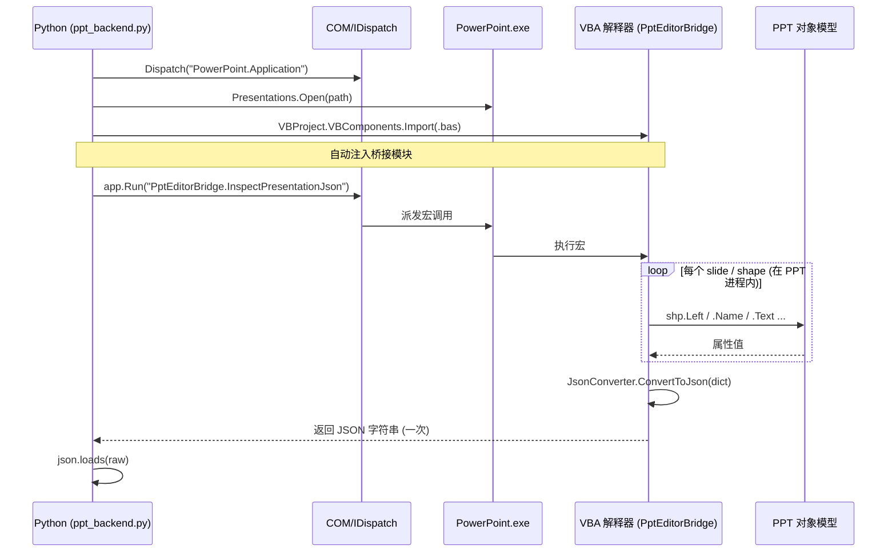

# VBA Backend：使用方式与技术实现原理

本文结合项目中 [`ppt_backend.py`](../skills/pptx-local-offline/scripts/ppt_backend.py) 的 `PowerPointVBA` 类、
[`PptEditorBridge.bas`](../skills/pptx-local-offline/references/PptEditorBridge.bas) 与
[`JsonConverter.bas`](../skills/pptx-local-offline/references/JsonConverter.bas)，
系统讲解 VBA backend 的用法和底层原理。

---

## 一、VBA 在本项目中的定位

本项目有 5 个 backend，本质都是「Python 驱动 PowerPoint」，区别只在用什么通道把指令送进 PowerPoint：

| backend | 通道 | 进程关系 |
|---------|------|---------|
| `pywin32` | Python 直接 COM IDispatch | 跨进程 |
| **`vba`** | **Python → COM `Application.Run` → PPT 内 VBA 执行** | **跨进程，但逻辑在 PPT 内跑** |
| `csharp` | Python → stdio 管道 → C# EXE → COM | 跨进程 |
| `csharp-addin` | in-proc COM add-in | 进程内 |
| `pywin32-addin` | in-proc Python add-in | 进程内 |

VBA backend 的特点：**Python 只发「一条指令 + JSON」，真正的循环/属性读写发生在 PowerPoint 进程内部的 VBA 解释器里**。
这把「每个属性一次跨进程 COM 调用」压缩成「一次 `Application.Run` + 一次 JSON 往返」。

---

## 二、整体架构与数据流



关键点：**循环在右半边（PPT 进程内）跑**，左边的 Python 只在两端各做一次跨进程调用。

---

## 三、使用方式

### 1. 命令行

```powershell
python ppt_backend.py deck.pptx --backend vba --inspect
```

代码入口是 `PowerPointVBA`，对外暴露和其他 backend 一致的接口：
`open()` / `inspect()` / `inspect_slide()` / `execute_action()` / `save()` / `close()`。

### 2. API 表面（Python 侧）

```python
b = PowerPointVBA(visible=False)
b.open("deck.pptx")
desc = b.inspect()                      # → dict
b.execute_action({"action": "modify_font", "slide": 1,
                  "target": {"type": "title"}, "params": {"bold": True}})
b.save("out.pptx")
b.close()
```

### 3. VBA 侧的两个模块

- **`PptEditorBridge.bas`** — 业务入口：`InspectPresentationJson` / `InspectSlideJson` /
  `ExecuteActionJson(actionJson)`，以及一系列 `Handle*` 处理函数。
- **`JsonConverter.bas`** — 纯 JSON 库：`ParseJson` / `ConvertToJson`。

---

## 四、技术实现原理（核心）

### 1. COM Automation —— Python 怎么「抓」到 PowerPoint

```python
self.app = win32com.client.Dispatch("PowerPoint.Application")
```

- `Dispatch` 通过注册表把 ProgID `PowerPoint.Application` 解析成 CLSID，调 `CoCreateInstance`
  启动（或连上已运行的）PowerPoint，拿到它的 **`IDispatch` 接口指针**。
- PowerPoint 是个 **out-of-process COM server（LocalServer32）**，所以 Python 和它是两个进程，
  跨进程调用由 COM 的 **marshaling（RPC/LRPC）** 代理完成。
- `pythoncom.CoInitialize()` 是每个线程用 COM 前必须初始化 COM 运行时（建立 apartment）。

### 2. `Application.Run` —— 调用 PPT 内的宏

```python
result = self.app.Run(f"{self.macro_module}.{macro_name}", *args)
```

- `Application.Run` 是 PowerPoint 对象模型暴露的方法，作用是「**在 PPT 进程内执行一个 VBA 宏**」，
  可带参数、有返回值。
- 这是 VBA backend 的**命门**：一次 `Run` = 一次跨进程调用，但它触发的是 PPT 内部 VBA 的整段执行。
  返回值（这里是 JSON 字符串）作为 `Variant` 经 COM marshaling 回传给 Python。
- 字符串在 COM 里是 **BSTR**（带长度前缀的 UTF-16），跨进程会被完整拷贝——这就是为什么我们让 VBA
  「一次性返回整个 JSON」而不是逐字段返回。

### 3. 自动注入 VBA 模块 —— `VBProject.VBComponents.Import`

```python
def _ensure_vba_modules(self):
    required = ["JsonConverter", self.macro_module]
    vba = self.prs.VBProject
    existing = {vba.VBComponents.Item(i).Name for i in range(1, vba.VBComponents.Count + 1)}
    for mod_name in required:
        if mod_name in existing:
            continue
        vba.VBComponents.Import(os.path.join(self._references_dir, f"{mod_name}.bas"))
```

- 演示文稿打开后，通过 **VBIDE 对象模型**（`VBProject` → `VBComponents`）把 `.bas` 源文件导入到
  这个 presentation 的 VBA 工程里。
- 这要求开启 **「信任对 VBA 工程对象模型的访问」**（PowerPoint 选项 → 信任中心 → 宏设置）。
  否则 `VBProject` 访问会被拒（`ProgrammaticAccessDenied`）。
- 这一步让 VBA backend **无需手工预装宏**——open 时按需注入，且改完 `.bas` 重新 open 就生效
  （模块名不存在时会重新导入）。

### 4. JSON 桥接协议

Python 和 VBA 之间不传对象，**只传 JSON 字符串**，解耦两边类型系统：

- **inspect 方向**：VBA 遍历 OM → 填 `Scripting.Dictionary`/`Collection` →
  `JsonConverter.ConvertToJson` → 返回字符串 → Python `json.loads`。
- **action 方向**：Python `json.dumps(action)` → `ExecuteActionJson(actionJson)` →
  VBA `JsonConverter.ParseJson` 还原成 Dictionary → `Select Case action` 分派到 `Handle*`。

错误用**带前缀的字符串**回传，避免 COM 异常跨进程丢失细节：

```python
ERROR_PREFIX = "__VBA_ERROR__:"
# VBA 出错时返回 "__VBA_ERROR__: 详细信息"，Python 检测前缀后 raise
```

### 5. VBA 的执行模型（为什么它是「解释执行」）

- VBA 源码编译成 **P-code（伪代码）**，由 VBA 运行时（`VBE7.DLL`）的**解释器**逐条执行——
  不是机器码，所以比 C/CPython 的 C 实现慢。
- VBA 访问 PowerPoint 对象（`shp.Left`）有两种绑定：
  - **早期绑定**（`Dim shp As Shape`）→ 编译期知道类型，走 **vtable** 直接调用，快。
    本项目都是强类型，所以读 PPT 属性这部分不慢。
  - **后期绑定**（`As Object` / `CreateObject`）→ 运行期 `IDispatch::GetIDsOfNames + Invoke`，慢。
    本项目里 `Scripting.Dictionary` 就是这种，是 inspect 的主要剩余开销。

---

## 五、一次 `inspect()` 的完整链路追踪

```text
Python: b.inspect()
  └─ app.Run("PptEditorBridge.InspectPresentationJson")   ← 跨进程 1 次
        ↓ (PPT 进程内，VBA 解释器)
        For Each sld In prs.Slides
            For Each shp In sld.Shapes
                InspectShape(prs, shp)
                  ├─ shp.Id/.Name/.Type/.Left/.Top/...     ← vtable 调 OM (快)
                  ├─ DetectShapeContent(shp)               ← On Error 探测 HasTable/HasChart
                  ├─ GetPlaceholderInfo(shp)
                  └─ 填 Scripting.Dictionary               ← IDispatch 派发 (慢)
        JsonConverter.ConvertToJson(result)               ← 解释器递归 + Mid$ 缓冲
  ← 返回 BSTR JSON                                          ← 跨进程 1 次
  └─ json.loads(raw)
```

整个过程**只有 2 次跨进程调用**，这是 VBA backend 相对 `pywin32`（每个属性都跨进程）的核心优势。

---

## 六、关键技术点 / 坑

| 点 | 说明 |
|----|------|
| `AutomationSecurity = 1` | msoAutomationSecurityLow，自动化打开文件时不弹宏安全警告，保证 `Application.Run` 能跑 |
| 信任 VBA 工程对象模型 | 否则 `prs.VBProject` 抛 `ProgrammaticAccessDenied`，无法自动导入模块 |
| `.bas` 改动需重新 open | 模块在 presentation 工程里；改了源文件要重新 open 才会重新 `Import` |
| 字符串走 BSTR | 跨进程整串拷贝，所以「一次返回整个 JSON」而非逐字段，减少 marshaling 次数 |
| 错误前缀协议 | COM 异常跨进程会丢栈，用 `__VBA_ERROR__:` 字符串把详情带回 |
| Save 格式码 | `.pptx`→24、`.ppt`→1，对应 `PpSaveAsFileType` 枚举 |

---

## 七、性能原理小结

- VBA backend 的设计**把 IPC 次数压到最低（2 次）**，所以它不慢在「跨进程」。
- 它慢在**语言层**：P-code 解释执行 + 后期绑定 `Scripting.Dictionary` 的 IDispatch 派发 +
  解释器递归序列化。
- `JsonConverter.bas` 采用 `Mid$` 预分配缓冲（StringBuilder）消除了最严重的 **O(n²) 字符串拼接退化**；
  剩下的差距（vs Python add-in 的 C 级 `json.dumps`）是 VBA 解释器的固有天花板。

### StringBuilder 优化（strategy 1）

| 之前 | 现在 |
|------|------|
| `result = result & chunk` | `SbAppend buf, pos, chunk` |
| O(n²) 字符串拼接（每次 realloc + copy） | O(n) 预分配缓冲 + `Mid$` 原地写入 |
| 每次拼接都重新分配整串 | 容量不够时倍增（`cap * 2`） |

核心助手（见 `JsonConverter.bas`）：

```vba
Private Sub SbAppend(ByRef buf As String, ByRef pos As Long, ByVal chunk As String)
    Dim n As Long
    n = Len(chunk)
    If n = 0 Then Exit Sub
    SbEnsure buf, pos + n
    Mid$(buf, pos + 1, n) = chunk   ' 原地写，不重新分配
    pos = pos + n
End Sub

Private Sub SbEnsure(ByRef buf As String, ByVal needed As Long)
    Dim cap As Long
    cap = Len(buf)
    If needed <= cap Then Exit Sub
    If cap = 0 Then cap = 64
    Do While cap < needed
        cap = cap * 2                ' 容量倍增
    Loop
    buf = buf & Space$(cap - Len(buf))
End Sub
```

### 还能再压的方向（针对 inspect，收益递减）

| 策略 | 攻击的瓶颈 | 预期 |
|------|-----------|------|
| 直接拼 JSON，跳过 `Scripting.Dictionary`/`Collection` | late-bound IDispatch 派发 + 解释器递归序列化 | 大头 |
| 缓存中间 COM 对象 + `With` | PPT 对象模型冗余往返（如重复 `.TextFrame`） | 中等 |
| 去掉热循环里的 `On Error Resume Next` 探测 | VBA 异常机制开销 | 中等 |

> 即便全部上，VBA in-proc inspect 也追不平 Python add-in 的 C 级 `json.dumps`——这是 P-code 解释器
> vs C 实现的语言层天花板。
